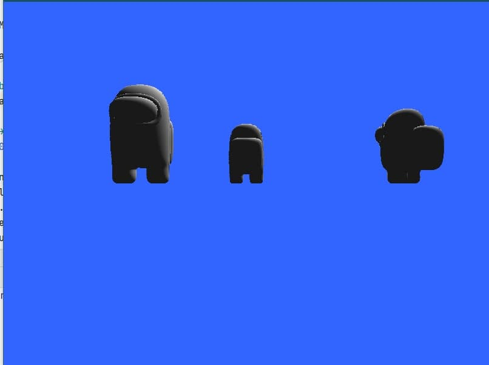

# 3D Renderer с нуля



## Как это собрать
### Под виндой
Для сборки нужен CMake и Visual Studio:
Команды для сборки:
```
cmake .
cmake --build .
```
Для работы нужды assimp и SDL, под x64_86 винду я их скомпилил и они должны автоматически скопироваться в папку с билдом
### Под не виндой
В теории можно, но я пока не пробовал + надо компилировать библиотеки